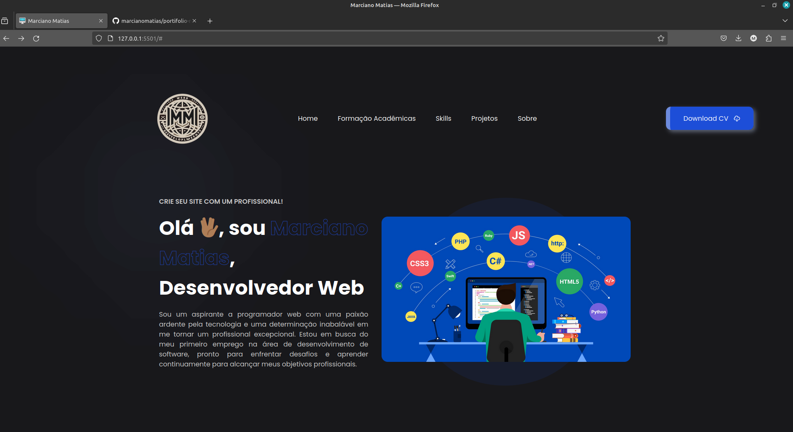
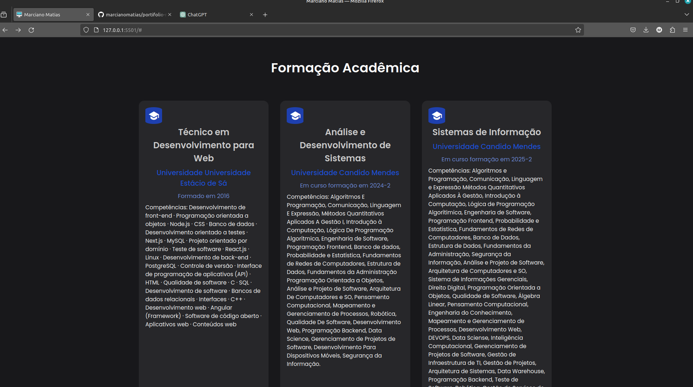
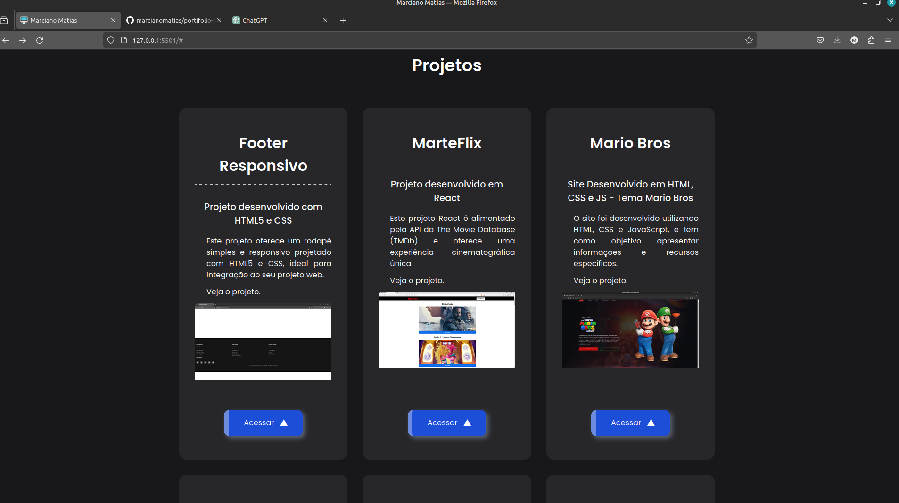

# Meu Portfólio

Este é o meu portfólio pessoal, onde compartilho alguns dos meus projetos e habilidades em desenvolvimento web. Este portfólio foi construído com HTML, CSS e JavaScript.

## Demonstração

Você pode acessar uma demonstração online do meu portfólio [aqui](link_para_a_demo.com).

## Habilidades

- HTML5
- CSS3
- JavaScript
- Versionamento de código com Git

## Capturas de Tela

## Como Executar

1. Clone o repositório:

## https://github.com/marcianomatias/portifolio-mms.git

2. Navegue até o diretório do projeto:

3. Abra o arquivo `index.html` em seu navegador.

## Contribuição

Contribuições são bem-vindas! Se você tiver sugestões, correções de bugs ou melhorias, por favor, abra uma issue ou envie uma pull request.

## Autor

Marciano Matias - [Seu Site](https://portifolio-mms.vercel.app/)

## Licença

Este projeto está licenciado sob a [Licença MIT](LICENSE).
